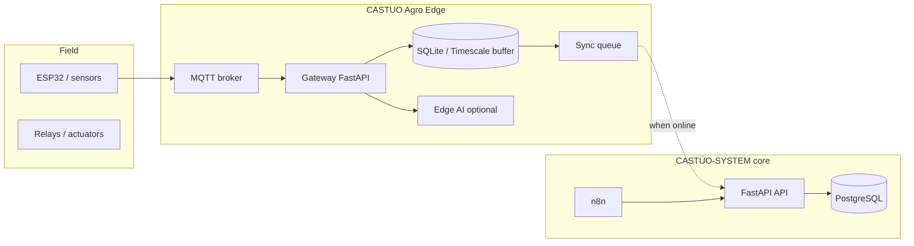

# CASTUO Agro Edge — Architecture

## Positioning

**Offline-first rural edge computing stack for agritech and environmental monitoring.**

This repository is the **edge plane** of CASTÚO-SYSTEM. The core platform ([Castuo-system](https://github.com/Traky12/Castuo-system)) owns API orchestration, SABIONDA OMEGA, compliance, and cloud EU deployment. Agro Edge owns what must keep working when the link is down.

## Logical diagram

## Design principles

1. **Offline-first** — irrigation, alarms, and buffering continue without cloud.
2. **Sovereign EU** — Mistral EU for edge AI; Hetzner/EU core sync targets.
3. **Modular protocols** — MQTT default; Modbus / LoRa as adapters under `protocols/`.
4. **Traceable telemetry** — every buffered row has timestamp + `site_id` + `device_id`.
5. **Clear boundary** — no duplicate of SABIONDA OMEGA; edge may run a **subset** of local rules until sync.

## Package map

| Path | Responsibility |
|------|----------------|
| `gateway/` | Ingest, buffer, health, sync orchestration |
| `edge_ai/` | Local inference, anomalies, irrigation hints |
| `protocols/` | Transport adapters |
| `hardware/` | Board profiles and wiring |
| `deployment/` | Docker, k3s, systemd, Hetzner edge |

## v0.1 scope

Functional: health API, telemetry ingest stub, SQLite schema, Docker Compose (MQTT + gateway).

Planned: MQTT subscriber loop, sync worker, ESP32 templates, relay GPIO module.
